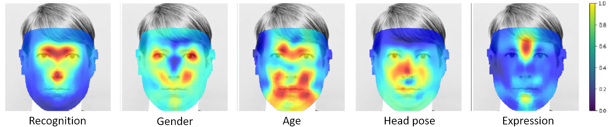

# Canonical Saliency Maps: Decoding Deep Face Models
 
Official code for the paper Canonical Saliency Maps: Decoding Deep Face Models. <be>
<b>Canonical Saliency</b> Maps are a new method which highlights relevant facial areas by projecting saliency maps onto a canonical face model. For more details, please refer to the <a href="https://cvit.iiit.ac.in/research/projects/cvit-projects/canonical-saliency-maps-decoding-deep-face-models">project page.</a>

For an online, runnable version of this code with all the data included, please visit: https://codeocean.com/capsule/2602708/tree 

# How to run
## Demo
Clone the repository and run <a href="https://github.com/ThrupthiAnn/Canonical-Salient-Maps/blob/main/codes/demo1_maps.ipynb">demo1_maps.ipynb</a> with the data already present in /data. This notebook takes  you through the steps of calculating a Canonical Image Saliency Map and Canonical Model Saliency Map. If you want to run the other demo notebooks, download the data from CodeOcean: https://codeocean.com/capsule/2602708/tree 

## Running for your model or image
For any face image, you need first to calculate the corresponding 3D alignment obtained using the code at: https://github.com/yfeng95/PRNet. Follow the instructions in <a href="https://github.com/ThrupthiAnn/Canonical-Salient-Maps/blob/main/codes/demo1_maps.ipynb">demo1_maps.ipynb</a>

# Citation
Please find the pdf of our paper <a href="https://cvit.iiit.ac.in/images/Projects/canonical/main_submitted1.pdf">here.</a>
If you use this code, please cite the following paper:

```tex
    @article{john2021canonical,
      title={Canonical saliency maps: Decoding deep face models},
      author={John, Thrupthi Ann and Balasubramanian, Vineeth N and Jawahar, CV},
      journal={IEEE Transactions on Biometrics, Behavior, and Identity Science},
      volume={3},
      number={4},
      pages={561--572},
      year={2021},
      publisher={IEEE}
  }
```


